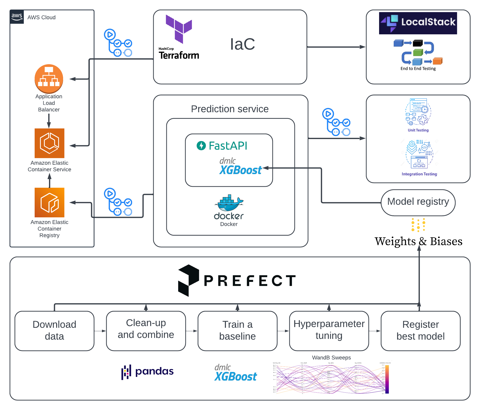

# The purpose of the project

The aim of this project is to build a full end-to-end ML project.
**Important:** The project main focus of the project is to show the MLOps flow and not to build the best model.

The underlying ML task is to predict bike ride duration given the start and end station, start time, bike type, and type of membership.

## Potential use case is the following:

A customer takes a bike from a station and wants to know how long it will take to get to the destination station. They enter the destination station and the rest of the features are logged automatically. The request is sent to the [web service](https://github.com/aaalexlit/capitalbikeshare-service) that returns the predicted duration and the customer can decide if they want to take the bike or not.

# Whole project structure



The project consists of 3 repos
1. [This repo](https://github.com/aaalexlit/capitalbikeshare-mlops) - contains the code for the data preparation, model training, and registering the model in the model registry
1. [The web service repo](https://github.com/aaalexlit/capitalbikeshare-service) - contains the code for the web service that serves the model
1. [The web service infra repo](https://github.com/aaalexlit/capitalbikeshare-service-terraform) - contains IAC code for the web service infrastructure created with Terraform

# Data and Modelling flow

This project is using [Weights and Biases](https://wandb.ai/site) for experiment tracking and model registry.
Please check the project on WANDB, it's public
https://wandb.ai/aaalex-lit/capitalbikeshare-mlops/overview

## The data
The data is provided by [Capital Bikeshare](https://www.capitalbikeshare.com/system-data) and contains information about bike rides in Washington DC.
Downloadable files are available on the following link https://s3.amazonaws.com/capitalbikeshare-data/index.html
The data used for the project is from April 2020 to Today (the scripts will get the new data automatically).
The reason is that in April 2020 the data format changed and the scripts are not compatible with the old format.

## The flow

1. Raw data download
1. Raw data combination
1. Data preparation
1. Modelling
    1. Baseline model
    1. Hyperparameter tuning using Weights and Biases Sweeps
    1. Training the model with the best hyperparameters

## The repository structure
The project structure is inspired by the [Cookiecutter Data Science](https://drivendata.github.io/cookiecutter-data-science/) template (but not directly created from it).

# Steps to reproduce:

**Important**:
This project is intended to be easily reproducible, but for that you'll need a conda environment
so you need a conda installation.


## General
1. `.env` file needs to be created in the root of the project with the following content. Or set the same environment variables on the command line.
    *Note*: You can try using some other project name, but I haven't tested it properly and something might eventually break
    ```shell
    WANDB_API_KEY=<your_wandb_api_key>
    PROJECT_NAME=capitalbikeshare-mlops
    ```
1. Create a python-10 based conda environment
    ```shell
    make create_environment
    ```
1. Activate the created environment
    ```shell
    conda activate $(PROJECT_NAME)
    ```
1. Install the dependencies from requirements.txt:
    ```shell
    make requirements
    ```
1. to be able to execute the code in packeges, the followint needs to be executed from the root of the project:
    ```shell
    export PYTHONPATH="${PYTHONPATH}:$(pwd)"
    ```
1. Login to Prefect Cloud
    ```shell
    prefect cloud login
    ```
## Data downloading and preparation:

It's possible to run all the processes either as python scripts or as prefect deployments
For prefect deployments please see a separate documentation in [prefect.md](docs/prefect.md)

1. Download raw data:
    ```shell
    python src/data/download_raw.py
    ```
1. Combine raw data into one file:
    ```shell
    python src/data/combine_raw.py
    ```
1. Prepare data for modelling:
    ```shell
    python src/data/prepare.py
    ```
## Modelling
1. Baseline xgboost model
    ```shell
    python src/models/xgb_baseline.py
    ```
1. Hyperparameter tuning for xgboost model using Weights and Biases Sweeps
    ```shell
    python src/models/xgb_sweep.py
    ```
1. Retrain a model with the best parameters from a sweep and add it to the model registry
    ```shell
    python src/models/register_best_model.py
    ```

## Running tests
Run unit tests
```shell
make test
```
## Lint, format, sort imports
```shell
make quality_checks
```
